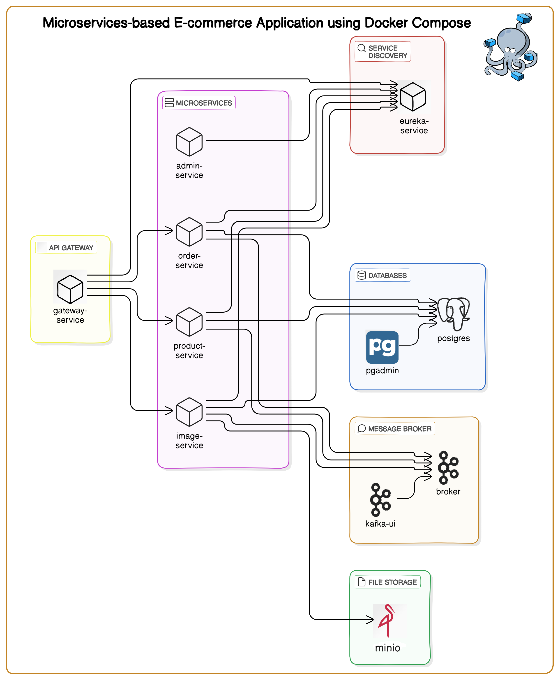

# e-commerce-microservices-with-react-spring-kafka-and-docker

By [Kajanan Sivarajah](https://github.com/kajanan16), [Ricky Wong](https://github.com/rickyltwong)

## Table of Contents

- [Description](#description)
- [Technologies Stack](#technologies-stack)
- [Project Structure](#project-structure)
- [Backend Features](#backend-features)
- [Frontend](#frontend)
- [Database Schema](#database-schema)
- [Setup](#setup)

## Description

This project is a full stack e-commerce application built with React, Spring, Apache Kafka, and Docker. 
The application is divided into multiple microservices, each responsible for a specific part of the application. 
The microservices communicate with each other using Open Feign client and Kafka. 
The application allows users to browse products, add products to the cart, and place orders.
The application uses Spring Cloud Stream to handle messaging with Kafka. 
It leverages StreamBridge to send messages to Kafka topics and listens for messages on Kafka topics using Spring Cloud Stream's messaging model.


## Technologies Stack

- **Backend:** Spring Framework
- **Deployment:** Docker
- **Frontend:** React
- **Database:** PostgreSQL
- **Message broker:** Kafka
- **Object Storage:** MinIO

## Project Structure

### Architecture



### Directory structure

The project consists of the following components:
```
e-commerce-microservices-with-react-spring-kafka-and-docker
├── e-commerce-api
│   ├── order-service
│   ├── product-service
│   ├── admin-service
│   ├── image-service
│   ├── gateway-service
│   ├── eureka-service
├── frontend
│   ├── Dockerfile
│   ├── package.json
│   ├── src
│   └── public
├── init.sh
├── seed.sql
├── docker-compose.yml
└── README.md
 ```

The application is containerized using Docker and deployed with Docker Compose, with each service built and dockerized separately using the Jib library. 
The project includes the following services:

### Business-related Services:
- **Product Service:** Manages product details.
- **Admin Service:** Manages admin operations.
- **Order Service:** Processes customer orders.
- **Image Service:** Serves image files. 

All resources are exposed as RESTful APIs.

### Infrastructure Services:
- **Gateway Service:** The only service exposed to the public, managing external requests and routing them to the appropriate microservices. All business-related services are internal, with only the gateway service exposed to the public. It handles routing and request management.
- **Eureka Service:** A service registry where all other services register and discover each other.

### Standalone Components:
- **Kafka:** For asynchronous communication.
- **Kafka UI:** For managing Kafka topics and events.
- **PostgreSQL:** The primary database (with schemas for products, orders, etc.).
- **PgAdmin:** A web-based database management tool for PostgreSQL.
- **MinIO:** An S3-compatible object storage server used to store and retrieve image files.

## Backend Features

### Product Service

### Image Service

- Uploads images from the filesystem to a MinIO bucket.
- Serves image data required during product fetch operations.

### Admin Service

#### Admin Operations (via Postman):
- **Create Product:** `POST /api/admin/products/{id}`
- **Delete Product:** `DELETE /api/admin/products/{id}`
- **Fetch Products:** `GET /api/admin/products`
- **Update Product:** `PUT /api/admin/products/{id}`
- **Create Inventory:** `POST /api/admin/inventory`
- **Fetch Inventory:** `GET /api/admin/inventory`

### Order Service

### Service Interaction
- **Synchronous Communication:** Implemented using OpenFeign.
- **Asynchronous Communication:** Handled via Kafka.

#### Open Feign

xxx

#### Kafka

Kafka is used for asynchronous communication between services. One of the Kafka flows implemented is the **OrderPlacedEvent** topic.
- When an order is placed, the **OrderService** sends a message to the **OrderPlacedEvent** topic.
- **ProductService** subscribes to this topic, receives the message, and updates the stock level of the product accordingly.

Other kafka flow would be deleteImageEvent:

### Logging
- Custom filters log the original request, rewritten request, and response.

## Frontend

The frontend is built with React in TypeScript and interacts with the backend through the following endpoints:

- **Fetch Products:** `GET /api/products`
- **Fetch Product Images:** `GET /api/images/{productname}`
- **Create Order:** `POST /api/orders`

### Pages:
1. **Products Page:** Displays the available products.
2. **Cart:** Manages items added to the cart, stored in `localStorage`.
3. **Success:** Displays transaction details after a successful order.

Other libraries used in frontend includes Mantine and Tanstack Query.

## Database Schema

### Products

| Column Name  | Data Type | Constraints                         |
| ------------ | --------- | ----------------------------------- |
| product_id   | UUID      | PRIMARY KEY                         |
| name         | TEXT      | NOT NULL                            |
| description  | TEXT      |                                     |
| price        | DECIMAL   | NOT NULL                            |
| created_at   | TIMESTAMP | DEFAULT CURRENT_TIMESTAMP           |
| updated_at   | TIMESTAMP | DEFAULT CURRENT_TIMESTAMP           |
| image_path   | TEXT      |                                     |

### Inventory

| Column Name  | Data Type | Constraints                         |
| ------------ | --------- | ----------------------------------- |
| inventory_id | UUID      | PRIMARY KEY                         |
| product_id   | UUID      | FOREIGN KEY REFERENCES Products     |
| quantity     | INTEGER   | NOT NULL                            |
| last_updated | TIMESTAMP | DEFAULT CURRENT_TIMESTAMP           |

### Orders

| Column Name  | Data Type | Constraints                         |
| ------------ | --------- | ----------------------------------- |
| order_id     | UUID      | PRIMARY KEY                         |
| order_date   | TIMESTAMP | DEFAULT CURRENT_TIMESTAMP           |
| total_amount | DECIMAL   | NOT NULL                            |

### Order_Items

| Column Name  | Data Type | Constraints                         |
| ------------ | --------- | ----------------------------------- |
| order_item_id| UUID      | PRIMARY KEY                         |
| order_id     | UUID      | FOREIGN KEY REFERENCES Orders       |
| product_id   | UUID      | FOREIGN KEY REFERENCES Products     |
| quantity     | INTEGER   | NOT NULL                            |

## Setup

1. Clone the Repository:
```
git clone https://github.com/yourusername/e-commerce-microservices-with-react-spring-kafka-and-docker.git
cd e-commerce-microservices-with-react-spring-kafka-and-docker
```

2. Run Initial Setup:
```
./init.sh
```
This script will build all services with jib library and run the docker compose.
The docker will run the `seed.sql` script to seed the product data into the application and the `image-service` will upload the product image files to the `minIO` bucket.

3. Run the frontend:
```
cd frontend
npm run dev
```

4. Access the application through: http://localhost:5173